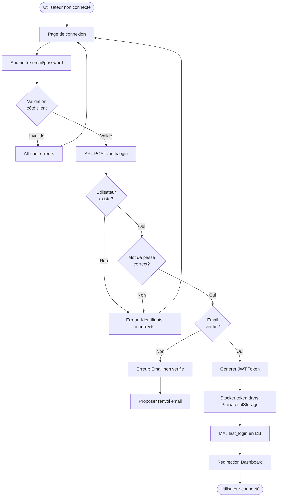
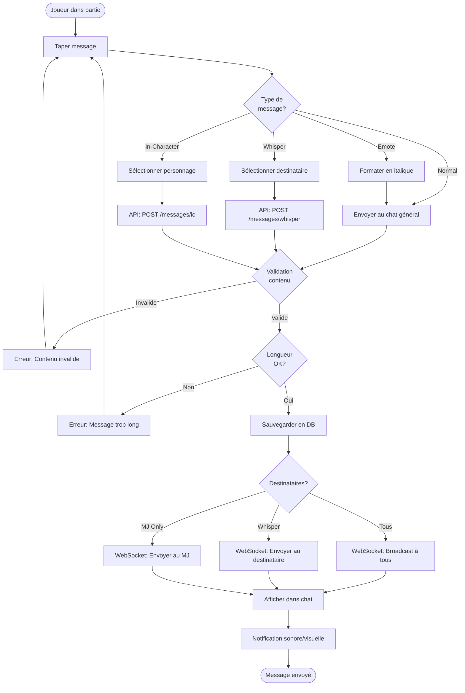

# Diagrammes de Flux - Processus OnlyRoll

## 1. Flux d'Authentification



## 2. Flux de Création de Partie

```mermaid
flowchart TD
    Start([Utilisateur connecté]) --> CreateBtn[Cliquer "Nouvelle Partie"]
    CreateBtn --> Form[Formulaire de création]
    Form --> Fill[Remplir: nom, description,<br/>nb joueurs max, public/privé]
    
    Fill --> Submit[Soumettre formulaire]
    Submit --> Validate{Validation}
    
    Validate -->|Invalide| ShowErrors[Afficher erreurs]
    ShowErrors --> Form
    
    Validate -->|Valide| API[API: POST /games]
    API --> CreateGame[Créer partie en DB<br/>status='preparation']
    CreateGame --> AssignGM[Assigner créateur comme MJ]
    AssignGM --> CreatePlayer[Créer entrée game_player]
    
    CreatePlayer --> CheckPublic{Partie<br/>publique?}
    CheckPublic -->|Non| SetPassword[Définir mot de passe?]
    CheckPublic -->|Oui| Skip[Continuer]
    SetPassword --> Skip
    
    Skip --> GenerateCode[Générer code unique partie]
    GenerateCode --> WSNotify[WebSocket: Notifier création]
    WSNotify --> Redirect[Redirection vers partie]
    
    Redirect --> End([Dans la partie comme MJ])
```

## 3. Flux de Lancer de Dés

```mermaid
flowchart TD
    Start([Joueur dans partie active]) --> Input[Saisir expression<br/>ex: 2d6+3]
    Input --> Click[Cliquer "Lancer"]
    
    Click --> Parse{Parser<br/>expression}
    Parse -->|Invalide| Error[Erreur: Expression invalide]
    Error --> Input
    
    Parse -->|Valide| CheckPrivate{Lancer<br/>privé?}
    
    CheckPrivate -->|Oui| CheckGM{Est MJ?}
    CheckGM -->|Non| Error2[Erreur: Réservé au MJ]
    CheckGM -->|Oui| PrivateRoll[API: POST /dice/roll-private]
    
    CheckPrivate -->|Non| PublicRoll[API: POST /dice/roll]
    
    PublicRoll --> Generate[Générer résultats aléatoires]
    PrivateRoll --> Generate
    
    Generate --> Calculate[Calculer total]
    Calculate --> Store[Sauvegarder en DB]
    
    Store --> CheckType{Type de<br/>lancer?}
    CheckType -->|Public| Broadcast[WebSocket: Broadcast à tous]
    CheckType -->|Privé| ShowGM[Afficher au MJ uniquement]
    
    Broadcast --> Display[Afficher résultat avec animation]
    ShowGM --> Display
    
    Display --> History[Ajouter à l'historique]
    History --> End([Lancer terminé])
```

## 4. Flux de Rejoindre une Partie

```mermaid
flowchart TD
    Start([Utilisateur sur liste parties]) --> Select[Sélectionner une partie]
    Select --> CheckPublic{Partie<br/>publique?}
    
    CheckPublic -->|Non| EnterPwd[Demander mot de passe]
    EnterPwd --> SubmitPwd[Soumettre mot de passe]
    SubmitPwd --> ValidatePwd{Mot de passe<br/>correct?}
    ValidatePwd -->|Non| ErrorPwd[Erreur: Mot de passe incorrect]
    ErrorPwd --> EnterPwd
    ValidatePwd -->|Oui| Continue1[Continuer]
    
    CheckPublic -->|Oui| Continue1
    
    Continue1 --> CheckMember{Déjà<br/>membre?}
    CheckMember -->|Oui| Enter[Entrer dans la partie]
    
    CheckMember -->|Non| CheckSlots{Places<br/>disponibles?}
    CheckSlots -->|Non| ErrorFull[Erreur: Partie complète]
    ErrorFull --> End1([Retour liste])
    
    CheckSlots -->|Oui| JoinAPI[API: POST /games/{id}/join]
    JoinAPI --> CreatePlayerEntry[Créer entrée game_player]
    CreatePlayerEntry --> NotifyWS[WebSocket: Notifier nouveau joueur]
    NotifyWS --> Enter
    
    Enter --> LoadGame[Charger données partie]
    LoadGame --> JoinRoom[WebSocket: Rejoindre room]
    JoinRoom --> ShowGame[Afficher interface de jeu]
    
    ShowGame --> End2([Dans la partie])
```

## 5. Flux de Déplacement de Token

```mermaid
flowchart TD
    Start([Token sur carte]) --> Select[Sélectionner token]
    Select --> CheckOwner{Propriétaire<br/>ou MJ?}
    
    CheckOwner -->|Non| CheckLocked{Token<br/>verrouillé?}
    CheckLocked -->|Oui| Error[Erreur: Token verrouillé]
    CheckLocked -->|Non| AllowMove[Autoriser déplacement]
    
    CheckOwner -->|Oui| AllowMove
    
    AllowMove --> Drag[Glisser-déposer token]
    Drag --> ValidatePos{Position<br/>valide?}
    
    ValidatePos -->|Non| Revert[Annuler déplacement]
    Revert --> Start
    
    ValidatePos -->|Oui| CalcDistance[Calculer distance parcourue]
    CalcDistance --> CheckMovement{Mouvement<br/>légal?}
    
    CheckMovement -->|Non| ShowWarning[Afficher avertissement]
    ShowWarning --> Confirm{Forcer<br/>déplacement?}
    Confirm -->|Non| Revert
    Confirm -->|Oui| Move[Déplacer token]
    
    CheckMovement -->|Oui| Move
    
    Move --> UpdateAPI[API: PATCH /tokens/{id}/position]
    UpdateAPI --> UpdateDB[MAJ position en DB]
    UpdateDB --> BroadcastWS[WebSocket: Broadcast mouvement]
    
    BroadcastWS --> UpdateOthers[MAJ position chez autres joueurs]
    UpdateOthers --> LogMove[Logger déplacement]
    
    LogMove --> End([Token déplacé])
```

## 6. Flux de Message dans le Chat



## Légende

- `[Rectangle]` : Action/Processus
- `{Losange}` : Décision/Condition
- `([Rounded])` : Début/Fin
- `-->` : Flux normal
- `-->|Label|` : Flux conditionnel